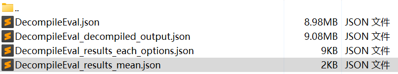
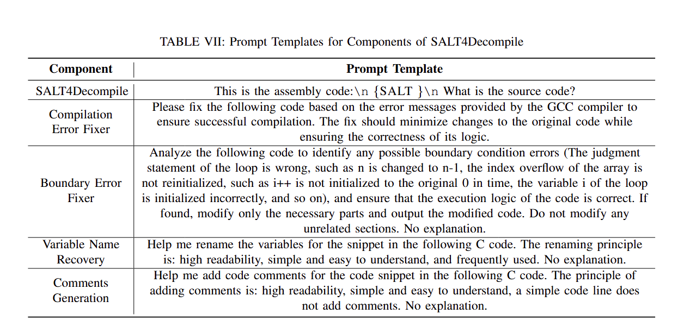

# SALT4Decompile
The code and dataset of SALT4Decompile, the paper title is "SALT4Decompile: Inferring Source-level Abstract Logic Tree for
LLM-Based Binary Decompilation."

# Requirements
Install the required environment, the python environment we use is python3.8
```shell
pip install -r Requirements.txt
```
# Evaluation

Firstly, we have uploaded all the evaluation results of every baseline, you can download them from the results folder.

Secondly, because our model requires the use of GPU and OpenAI's API token. We provide decompiled results of all baselines to run our evaluation code directly.
You can run the evaluation script by the following commands:
```python
python Eval_all_baselines.py -s xx/decompile-eval_test_rate.json -d xx/all_baselines/ -s xx/savepath
```
You can download the related files from the data folder. When the execution of this script is finished, we can get all the relevant evaluation results with JSON format in the output path you specified, as shown below:

`

The results of each optimization option are saved in the path (DecompileEval_results_each_options.json).


In addition, you can use the trained model (SALT4EXE, we have released the models of two-parameter scales, [1.3B](https://drive.google.com/file/d/1hI_yJKHPx1A--wTxA_eymC0TVtU7IIPh/view?usp=sharing) and [6.7B](https://drive.google.com/file/d/1FeUj-ZjeHKh1X3Wb2AW-f7_ItYfDB4Kk/view?usp=sharing)) to generate our draft code and run the draft_code_optimization.py script including the two fixers and symbolic information restorer to optimize the draft code. 

Please note that you will need a GPU to run our SALT4EXE model. DecompileEval_path including the DecompileEval test dataset with our SALT, which can be extracted through the extract_salt_from_dataset.py script.
```python
python generate_draft_code.py model_path DecompileEval_path save_path
```
Please note that you will need an OPENAI API token to run our draft_code_optimization.py script.
```python
python draft_code_optimization.py -p xx/SALT4EXE_output.json -o xx/output_path -s xx/final_result_save_path
```

# SALT4EXE Model Training
You can extract the SFT dataset from the EXEBENCH dataset[^1] and construct the DecompileEval test dataset from the following scripts:
```python
python extract_salt_from_dataset.py -p xx/base_path -n your_save_name -h xx/DecompileEval_path
```
If you want to retrain the SALT4EXE model, you can use the SFT dataset or download our SFT dataset on the link (we will release it later). You can run the fine-tuning script as the following command:
```shell
nohup bash run_finetune_SALT4EXE.sh > logs/train.log 2>&1 &
```
# Others
If you want to process the test dataset about the TCP, you can use this script to tackle it.
```python
python add_code2TCP.py # after modifying your path settings
```

Maybe you need to modify some path settings to run it.


# Prompt templates

`

# Reference
[^1]: Jordi Armengol-Estapé, Jackson Woodruff, Alexander Brauckmann, José Wesley de Souza Magalhães, and Michael F. P. O’Boyle. 2022. Exebench: An ml-scale dataset of executable c functions. In Proceedings of the 6th ACM SIGPLAN International Symposium on Machine Programming, MAPS 2022, page 50–59, New York, NY, USA. Association for Computing Machinery.
